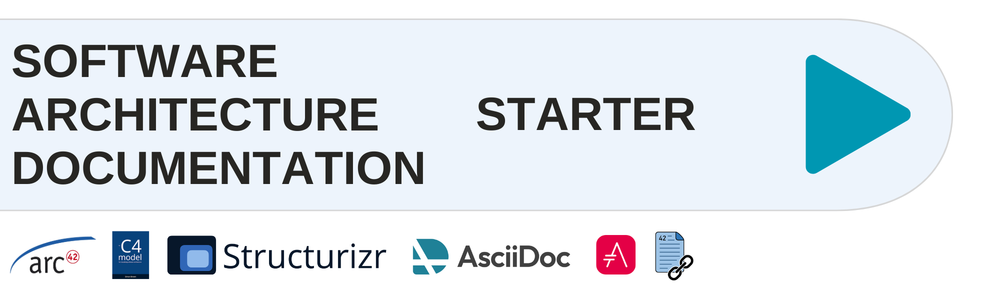

:icons: font
:toc: left
:toclevels: 3
:toc-title: Inhalt

= Software Architecture Documentation Starter with arc42 and C4 Model

This example shows how to use https://arc42.org/[arc42] in combination with the https://c4model.com/[C4 model] with the Documentation as Code technique.

It shows how to use the techniques described in https://www.workingsoftware.dev/software-architecture-documentation-the-ultimate-guide/[The Ultimate Guide to Software Architecture Documentation].

Check out the deployed https://bitsmuggler.github.io/arc42-c4-software-architecture-documentation-example/[example HTML build] provided on GitHub Pages.

Get more details in the https://www.youtube.com/watch?v=TLcUISoEn2s[Step-by-step video tutorial] available on YouTube.

== Quick Start

Get started in 3 simple steps:

[source, bash]
----
# 1. Generate diagrams from C4 model
./dtcw exportStructurizr

# 2. Build HTML documentation
./dtcw generateHTML

# 3. Open the result
open build/html5/internet-banking-system.html
----

For more details, see <<Build the software architecture documentation>>

== Techniques & Technologies

=== Documentation

[cols="1,3"]
|===
|https://arc42.org/[arc42] |Structure template for software architecture documentation
|https://asciidoc.org/[AsciiDoc] |Markup format for writing documentation
|https://asciidoctor.org/[Asciidoctor] |Processor to generate HTML, PDF and other formats
|===

=== Architecture Modeling

[cols="1,3"]
|===
|https://c4model.com/[C4 Model] |Abstraction-first approach to diagramming software architecture
|https://structurizr.com/dsl[Structurizr DSL] |DSL to describe C4 models as code
|https://github.com/structurizr/cli[Structurizr CLI] |CLI to export PlantUML diagrams from Structurizr DSL
|===

=== Tooling & Automation

[cols="1,3"]
|===
|https://doctoolchain.org[docToolchain] |Automation for generating documentation
|https://kroki.io[Kroki] |Diagram generation service
|https://github.com/npryce/adr-tools[adr-tools] |Generate and manage Architecture Decision Records (ADRs)
|https://www.workingsoftware.dev/technical-debt-records/[Technical Debt Records] |Record and track technical debts (TDRs)
|===

TIP: For more tech inspiration take a look at the https://www.workingsoftware.dev/documentation-as-code-tools[Documentation as Code Technology Radar].

== Prerequisites

[IMPORTANT]
====
If you don't plan to use the https://github.com/npryce/adr-tools[adr-tools], you can skip this step. Please make sure that Chapter 09 Architecture Decisions does not contain any references to the ADRs.
====

=== Install adr-tools and adjust the ADR template

The ADR template is based on Markdown and the ADR chapters must be adapted to the chapter levels of the arc42 template.

. Install https://github.com/npryce/adr-tools[adr-tools]
. Get the path of the adr template of the adr-tools via `adr config`
. Replace the content of the `template.md` file with the content of the link:./adr-template.md[adr-template.md] file of this repository.

==== Migrate the generated markdown based decisions with docToolchain

If you have already generated ADRs with the adr-tools, you can migrate them to the AsciiDoc format with the following steps.

[source, bash]
----
./dtcw exportMarkdown && cp ./build/adrs/*.adoc ./documentation/adrs/
----

== Build the software architecture documentation

=== Available Commands

https://doctoolchain.org/docToolchain/[docToolchain] provides the following commands via the `./dtcw` wrapper script:

[cols="2,3"]
|===
|Command |Description

|`./dtcw exportStructurizr`
|Generate PlantUML diagrams from the C4 Model (Structurizr DSL)

|`./dtcw generateHTML`
|Generate HTML documentation

|`./dtcw generatePDF`
|Generate PDF documentation

|`./dtcw generateSite`
|Generate documentation as Microsite

|`./dtcw exportMarkdown`
|Convert Markdown ADRs to AsciiDoc
|===

NOTE: These examples use the public https://kroki.io[kroki.io] instance to generate the diagrams.
For your own documentation, replace the references to kroki.io with your own kroki instance.

[appendix]
== Manual Setup (without dtcw)

If you want to build everything without the `./dtcw` script, you can use the following commands.

=== Generate the PlantUML diagrams from the Structurizr DSL

*With the Structurizr CLI via Docker Image*

[source, bash]
----
docker run -it --rm -v $PWD:/usr/local/structurizr structurizr/cli export -w documentation/bank.dsl -format plantuml/structurizr -output documentation/diagrams
----

*With a local installed Structurizr CLI*

Download the https://github.com/structurizr/cli/releases[structurizr-cli], unzip and move it into `./bin/structurizr-cli` or use the latest Docker Image

[source, bash]
----
curl --show-error --location https://github.com/structurizr/cli/releases/download/v2025.11.09/structurizr-cli.zip  -o tmp.zip && mkdir -p bin/structurizr-cli && unzip -d bin/structurizr-cli tmp.zip && rm tmp.zip
----

Generate the diagrams from the structurizr workspace model

[source, bash]
----
./bin/structurizr-cli/structurizr.sh export -w documentation/bank.dsl -format plantuml/structurizr -output documentation/diagrams
----

== License

This project is open source. Feel free to use it as a starting point for your own software architecture documentation.

== Contributing

Contributions are welcome! Please feel free to submit issues or pull requests.